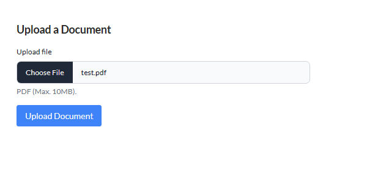

[![Contributors][contributors-shield]][contributors-url]
[![Forks][forks-shield]][forks-url]
[![Stargazers][stars-shield]][stars-url]
[![Issues][issues-shield]][issues-url]
[![LinkedIn][linkedin-shield]][linkedin-url]

<!-- PROJECT LOGO -->
<br />
<div align="center"> 
  

  <h3 align="center">Frontend Assessment Test</h3>

  <p align="center">
    Collaborative Document Signing Manager
    <br />
    <a href="https://to-note-omega.vercel.app"><strong>See Live Version »</strong></a>
    <br />
    <br />
    <a href="https://to-note-omega.vercel.app">View Demo</a>
    ·
    <a href="https://github.com/Chizaram-Igolo/to-note/issues">Report Bug</a>
    ·
    <a href="https://github.com/Chizaram-Igolo/to-note/issues">Request Feature</a>
  </p>
</div>

<!-- TABLE OF CONTENTS -->
  <p>Table of Contents</p>
  <ol>
    <li>
      <a href="#about-the-project">About The Project</a>
      <ul>
        <li><a href="#built-with">Built With</a></li> 
        <li><a href="#user-stories">User Stories</a></li>
      </ul>
    </li>
    <li>
      <a href="#getting-started">Getting Started</a>
      <ul>
        <li><a href="#prerequisites">Prerequisites</a></li>
        <li><a href="#installation">Installation</a></li>
      </ul>
    </li>
    <li><a href="#usage">Usage</a>
    <ul>
       <li><a href="#api-consumption">API Consumption</a></li>
    </ul>
    </li> 
  </ol>

<!-- ABOUT THE PROJECT -->

## About The Project


This is a frontend application built with React.js that consumes the endpoints listed at https://dev-api.gettonote.com/api/docs.

It takes care of:

- User Authentication
- Document Upload of PDF files
- Dispaying PDF Documents
- Managing Document Signer Participation

Hence, requirements 1, 2, 3 and 5 were met.

## Built With

- [![React][React.js]][React-url]
- [![Vite][Vite]][Vite-url]
- [![TypeScript][TypeScript]][TypeScript-url]
- [![TailwindCSS][TailwindCss]][TailwindCSS-url]

<!-- GETTING STARTED -->

## Getting Started

To get a local copy up and running follow these simple example steps.

### Prerequisites

You need to have `npm` installed on your computer in order to be able to install and run the project.

- npm
  ```sh
  npm install npm@latest -g
  ```

### Installation

Below is an example of how you can instruct your audience on installing and setting up your app. This template doesn't rely on any external dependencies or services.

1. Clone the repo
   ```sh
   git clone https://github.com/Chizaram-Igolo/to-note.git
   ```
2. Install NPM packages
   ```sh
   npm install
   ```
3. Run the Project
   ```sh
   npm run dev
   ```
4. Navigate to `http://127.0.0.1:5173/` (or the exposed port) on your favourite browser

<!-- USAGE EXAMPLES -->

## Usage

The following shows the functionality of the application with respect to the endpoints provided.

### API Consumption

```js
// ./src/utils/constants.ts
export const API_URL = "https://dev-api.gettonote.com/api/v1/";
```

### 1. User Authentication

<h4 style="font-size: 1.4rem;">i. Logging in</h4>

```sh
POST https://dev-api.gettonote.com/api/v1/user/login
```

<table>
<tr>
<th>Component</th>
<th>API Call</th>
</tr>
<tr>
<td>
  

<p>./src/pages/Authentication/SignIn.tsx</p> 
<p><strong>Login Screen</strong></p>
</td>
<td>

```js
// ./src/utils/types.ts
export type LoginValuesPrepared = {
  email: string,
  password: string,
  entry_point: string,
};

// ./src/utils/api.ts
export function login(data: LoginValuesPrepared) {
  return axios({
    method: "post",
    url: `${API_URL}user/login`,
    headers,
    data,
  });
}
```

</td>
</tr>
</table>

<br/>

<h4 style="font-size: 1.4rem;">ii. Registering User</h4>

```sh
POST https://dev-api.gettonote.com/api/v1/user/register
```

<table>
<tr>
<th>Component</th>
<th>API Call</th>
</tr>
<tr>
<td>
  

<p>./src/pages/Authentication/SignUp.tsx</p>
<p><strong>Register Screen</strong></p> 
</td>
<td>

```js
// ./src/utils/types.ts
export type RegisterValuesPrepared = {
  first_name: string,
  last_name: string,
  role: string,
  email: string,
  password: string,
};

// ./src/utils/api.ts
export function register(data: RegisterValuesPrepared) {
  return axios({
    method: "post",
    url: `${API_URL}user/register`,
    headers,
    data,
  });
}
```

</td>
</tr>
</table>

<br/>

<h4 style="font-size: 1.4rem;">iii. Profile Details</h4>

```sh
GET https://dev-api.gettonote.com/api/v1/user/profile
```

<table>
<tr>
<th>Component</th>
<th>API Call</th>
</tr>
<tr>
<td>
<div style="width: 300px; margin-bottom: 30px">

<p style="margin-bottom: 0px"><strong>Name: </strong>John Doe</p>
<p><strong>Email: </strong>user@tonote.com</p>
</div>
<div style="width: 300px; margin-bottom: 30px">
 
<p style="margin-bottom: 0px"><strong>Name: </strong>Woman Woman</p>
<p><strong>Email: </strong>wonderwoman@yahoo.com</p>
</div> 
<div style="width: 300px; margin-bottom: 30px">
 
<p style="margin-bottom: 0px"><strong>Name: </strong>Bill Gates</p>
<p><strong>Email: </strong>bill@tonote.com</p>
</div>
<p>./src/pages/Authentication/SignIn.tsx</p>
<p><strong>Register Screen</strong></p>  
</td>
<td>

```js
// ./src/utils/types.ts
export type UserType = {
  access_locker_documents: boolean;
  address?: string | null;
  avatar?: string | null;
  bvn?: number | string | null;
  city?: string | null;
  country?: string | null;
  created_at: string | null;
  dob?: string | null;
  drivers_license_no: string | null;
  email: string;
  first_name: string;
  gender?: string;
  id: string;
  identity_number?: string | null;
  identity_type?: string | null;
  image: string;
  initials: string;
  ip_address: string;
  is_complete?: boolean | null;
  is_online: boolean;
  last_name: string;
  national_verification: boolean;
  nin?: string | number | null;
  permissions: string[];
  phone?: string | null;
  role: string[];
  state?: string | null;
  system_verification: boolean;
  updated_at: string;
};

export function getProfile(token: Token) {
  return axios({
    method: "get",
    url: `${API_URL}user/profile`,
    headers,
    params: token,
  });
```

</td>
</tr>
</table>

<br/>

### 2. Document Upload

```sh
POST https://dev-api.gettonote.com/api/v1/document-upload-convert
```

<table>
<tr>
<th>Component</th>
<th>API Call</th>
</tr>
<tr>
<td>
<div style="width: 400px; margin-right: 50px; margin-bottom: 20px">

<p>Before upload</p> 
</div>
<div style="width: 400px; margin-right: 50px; margin-bottom: 20px">

<p>After upload</p>
</div>
<div style="width: 400px; margin-right: 50px; margin-bottom: 20px">

<p>File too large</p>
</div>
<p>./src/pages/Dashboard/UploadDocument.tsx</p>
<p><strong>Upload Document Screen</strong></p>
</td>
<td>

```js
// ./src/utils/types.ts
export type FileData = {
  title: string,
  files: string[] | ArrayBuffer[],
};

export type Token = {
  token?: string,
  token_type?: string,
};

// Snippet that prepares the PDF content as a base64 string.

// ./src/pages/Dashboard/UploadDocument.
type FileChangeEventType = React.FormEvent<HTMLInputElement>;

function handleFileChange (event: FileChangeEventType) {
    ...
    // FileReader function for read the file.
    let fileReader = new FileReader();
    // Onload of file read the file content
    fileReader.onload = function (fileLoadedEvent) {
    const base64str = fileLoadedEvent.target.result;
    };

    // Convert PDF data to base64
    fileReader.readAsDataURL(file);
    ...
}

// ./src/utils/api.ts
export function uploadDocument(data: FileData, token: Token) {
  return axios({
    method: "post",
    url: `${API_URL}document-upload-convert`,
    headers: {
      Accept: "application/json",
      "Content-Type": "multipart/form-data",
      Authorization: `Bearer ${token.token}`,
    },
    data,
  });
}
```

</td>
</tr>
</table>

<br/>

### 3. Displaying Document

<h4 style="font-size: 1.4rem;">i. Documents List</h4>

```sh
POST https://dev-api.gettonote.com/api/v1/documents
```

<table>
<tr>
<th>Component</th>
<th>API Call</th>
</tr>
<tr>
<td>


<p>./src/pages/Dashboard/DocumentsList.tsx</p>
<p><strong>Documents List Screen</strong></p>

</td>
<td>

```js
// ./src/utils/types.ts
export type Token = {
  token?: string,
  token_type?: string,
};

// ./src/utils/api.ts
export function getDocuments(token: Token) {
  return axios({
    method: "get",
    url: `${API_URL}documents`,
    headers: {
      Accept: "application/json",
      "Content-Type": "application/json;charset=UTF-8",
      Authorization: `Bearer ${token.token}`,
    },
  });
}
```

</td>
</tr>
</table>

<br/>

<h4 style="font-size: 1.4rem;">ii. View Document</h4>

```sh
GET https://dev-api.gettonote.com/api/v1/documents/{document_id}
```

<table>
<tr>
<th>Component</th>
<th>API Call</th>
</tr>
<tr>
<td>


<p>./src/pages/Dashboard/DocumentsList.tsx</p>
<p><strong>Documents List Screen</strong></p>

</td>
<td>

```js
// ./src/utils/types.ts
export type Token = {
  token?: string,
  token_type?: string,
};

// ./src/utils/api.ts
export function getDocument(document_id: string, token: Token) {
  return axios({
    method: "get",
    url: `${API_URL}documents/${document_id}`,
    headers: {
      Accept: "application/json",
      "Content-Type": "application/json;charset=UTF-8",
      Authorization: `Bearer ${token.token}`,
    },
  });
}
```

</td>
</tr>
</table>

<br/>

### 5. Document Participants

i. Add Self as Participant

```sh
GET https://dev-api.gettonote.com/api/v1/document-participant-add-self/{document_id}
POST https://dev-api.gettonote.com/api/v1/document-participants
POST https://dev-api.gettonote.com/api/v1/document-participants-send-email
```

<table>
<tr>
<th>Component</th>
<th>API Call</th>
</tr>
<tr>
<td> 
<div style="width: 400px; margin-right: 50px; margin-bottom: 20px">
 
<p>Retrieve Participants</p>
</div> 
<div style="width: 400px; margin-right: 50px; margin-bottom: 20px">
 
<p>Display and Fill Form to Send Email Invite</p>
</div> 
<div style="width: 400px; margin-right: 50px; margin-bottom: 20px">
 
<p>Email Invite Successfully Sent</p>
</div> 
<div style="width: 400px; margin-right: 50px; margin-bottom: 20px">
 
<p>Participants List Updated (after page refresh)</p>
</div> 
<p>./src/pages/Dashboard/ViewDocument.tsx</p>
<p><strong>ViewDocument Screen</strong></p> 
</td>
<td>

```js
// ./src/utils/types.ts
export type Participant = {
  document_id: string,
  first_name: string,
  last_name: string,
  phone: string,
  email: string,
  role: string,
};

export type EmailInviteData = {
  message: string,
  files: string[] | ArrayBuffer[],
  participants: Participant[],
};

// ./src/utils/api.ts
export function addSelfAsParticipant(document_id: string, token: Token) {
  return axios({
    method: "get",
    url: `${API_URL}document-participant-add-self/${document_id}`,
    headers: {
      Accept: "application/json",
      "Content-Type": "application/json;charset=UTF-8",
      Authorization: `Bearer ${token.token}`,
    },
  });
}

// This endpoint at
// POST https://dev-api.gettonote.com/api/v1/document-participants
// seems to not be working
// Participants data were retrieved from the `document` object
// `documentUploads` array where available.

export function sendParticipantEmailInvitation(
  data: EmailInviteData,
  token: Token
) {
  return axios({
    method: "post",
    url: `${API_URL}document-participants-send-email`,
    headers: {
      Accept: "application/json",
      "Content-Type": "application/json;charset=UTF-8",
      Authorization: `Bearer ${token.token}`,
    },
    data,
  });
}
```

</td>
</tr>
</table>

<!-- MARKDOWN LINKS & IMAGES -->
<!-- https://www.markdownguide.org/basic-syntax/#reference-style-links -->

[contributors-shield]: https://img.shields.io/github/contributors/Chizaram-Igolo/to-note.svg?style=for-the-badge
[contributors-url]: https://github.com/Chizaram-Igolo/to-note/graphs/contributors
[forks-shield]: https://img.shields.io/github/forks/Chizaram-Igolo/to-note.svg?style=for-the-badge
[forks-url]: https://github.com/Chizaram-Igolo/to-note/network/members
[stars-shield]: https://img.shields.io/github/stars/Chizaram-Igolo/to-note.svg?style=for-the-badge
[stars-url]: https://github.com/Chizaram-Igolo/to-note/stargazers
[issues-shield]: https://img.shields.io/github/issues/Chizaram-Igolo/to-note.svg?style=for-the-badge
[issues-url]: https://github.com/Chizaram-Igolo/to-note/issues
[linkedin-shield]: https://img.shields.io/badge/-LinkedIn-black.svg?style=for-the-badge&logo=linkedin&colorB=555
[linkedin-url]: https://linkedin.com/in/emmanueligolo
[React.js]: https://img.shields.io/badge/React-20232A?style=for-the-badge&logo=react&logoColor=61DAFB
[React-url]: https://reactjs.org/
[Vite]: https://img.shields.io/badge/vite-%23646CFF.svg?style=for-the-badge&logo=vite&logoColor=white
[Vite-url]: https://vitejs.dev/
[TypeScript]: https://img.shields.io/badge/typescript-%23007ACC.svg?style=for-the-badge&logo=typescript&logoColor=white
[TypeScript-url]: https://www.typescriptlang.org/
[TailwindCSS]: https://img.shields.io/badge/tailwindcss-%2338BDF8.svg?style=for-the-badge&logo=tailwind-css&logoColor=white
[TailwindCSS-url]: https://tailwindcss.com/
